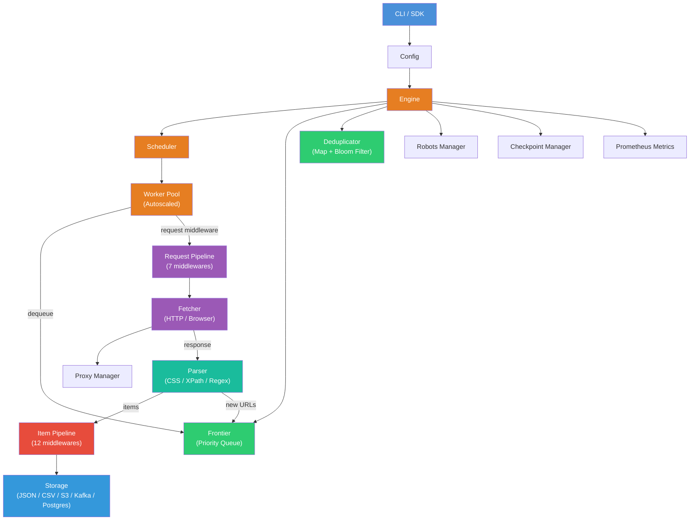

<div align="center">

# ScrapeGoat

### The high-performance distributed web scraping framework written in Go.

**Scrapy's architecture + Go's concurrency + distributed crawling. One binary, zero dependencies.**

[](https://goreportcard.com/report/github.com/IshaanNene/ScrapeGoat)
[](https://opensource.org/licenses/MIT)
[](https://pkg.go.dev/github.com/IshaanNene/ScrapeGoat)
[](https://github.com/IshaanNene/ScrapeGoat/stargazers)
[](https://github.com/IshaanNene/ScrapeGoat/network)
[](https://github.com/IshaanNene/ScrapeGoat/issues)
[](https://github.com/IshaanNene/ScrapeGoat)
[](https://github.com/IshaanNene/ScrapeGoat)

</div>

---

## Why ScrapeGoat?

| Tool | Weakness | ScrapeGoat's Advantage |
|------|----------|----------------------|
| **Scrapy** | Python, slower concurrency | Go goroutines = 10x throughput |
| **Playwright** | Heavy browser automation | Lightweight HTTP + optional browser |
| **Apify** | SaaS lock-in, paid tiers | Self-hosted, open-source |
| **Colly** | Not distributed, limited pipeline | Distributed + full middleware pipeline |

> **ScrapeGoat combines Scrapy's architecture + Go's concurrency + distributed crawling.**

---

## Quick Start

```bash
# Install
go install github.com/IshaanNene/ScrapeGoat/cmd/scrapegoat@latest

# Auto-extract structured data from any URL (no code needed!)
scrapegoat extract https://books.toscrape.com

# Create a project
scrapegoat new project my_scraper
cd my_scraper

# Run your spider
go run ./spiders/
```

## One-Liner Auto-Extract

```bash
$ scrapegoat extract https://books.toscrape.com

{
  "url": "https://books.toscrape.com",
  "title": "All products | Books to Scrape",
  "type": "product",
  "data": [
    {"_type": "product", "name": "A Light in the Attic", "price": "£51.77", "rating": 3},
    {"_type": "product", "name": "Tipping the Velvet", "price": "£53.74", "rating": 1}
  ]
}
```

---

## Architecture



---

## Spider Interface (Scrapy-Style)

```go
type ProductSpider struct{}

func (s *ProductSpider) Name() string { return "products" }

func (s *ProductSpider) StartURLs() []string {
    return []string{"https://books.toscrape.com"}
}

func (s *ProductSpider) Parse(resp *scrapegoat.Response) (*scrapegoat.SpiderResult, error) {
    result := &scrapegoat.SpiderResult{}
    resp.Doc.Find(".product_pod").Each(func(i int, s *goquery.Selection) {
        item := scrapegoat.NewItem(resp.URL)
        item.Set("title", s.Find("h3 a").AttrOr("title", ""))
        item.Set("price", s.Find(".price_color").Text())
        result.Items = append(result.Items, item)
    })
    return result, nil
}

func main() {
    scrapegoat.RunSpider(&ProductSpider{},
        scrapegoat.WithConcurrency(10),
        scrapegoat.WithMaxDepth(3),
        scrapegoat.WithOutput("json", "./output"),
    )
}
```

---

## Features

| Category | Features |
|----------|----------|
| **Core Engine** | Priority queue frontier, per-domain throttling, autoscaled worker pool, Bloom filter dedup |
| **Parsing** | CSS selectors, XPath, Regex, JSON-LD, OpenGraph, structured data, auto-extraction |
| **Anti-Bot** | 50+ user agents, TLS fingerprinting, header rotation, session pools, Cloudflare detection, CAPTCHA solving |
| **Middleware** | 7 request middlewares + 12 item pipeline middlewares, fully extensible |
| **Storage** | JSON, JSONL, CSV, S3, Kafka, PostgreSQL plugins |
| **Distributed** | Master/worker architecture, Redis queue, horizontal scaling |
| **Browser** | Headless Chromium via go-rod, JS rendering, form filling, infinite scroll |
| **Observability** | Prometheus metrics, OpenTelemetry tracing, web dashboard, real-time stats |
| **DevEx** | CLI scaffolding, REPL, YAML config, checkpoint pause/resume, `robots.txt` compliance |
| **Extras** | SEO audit, sitemap crawler, content change detection, scheduled re-crawling |

---

## CLI Commands

```bash
scrapegoat crawl <url>           # Crawl with link following
scrapegoat extract <url>         # Auto-extract structured data
scrapegoat search <url>          # Full-text search indexing
scrapegoat new spider <name>     # Scaffold a spider
scrapegoat new project <name>    # Scaffold entire project
scrapegoat master                # Start distributed coordinator
scrapegoat worker                # Start distributed worker
scrapegoat scale <n>             # Scale workers
scrapegoat dashboard             # Launch web dashboard
scrapegoat benchmark <url>       # Performance benchmarks
scrapegoat config                # Show configuration
scrapegoat version               # Print version
```

---

## Plugin Ecosystem

```go
// Register built-in plugins
registry := plugin.NewRegistry(logger)
builtin.RegisterBuiltinPlugins(registry, logger)

// Available plugins:
// • scrapegoat-s3        — S3 storage
// • scrapegoat-kafka     — Kafka publisher
// • scrapegoat-postgres  — PostgreSQL storage

// Custom plugin
type MyPlugin struct{}
func (p *MyPlugin) Name() string            { return "my-plugin" }
func (p *MyPlugin) Type() plugin.PluginType { return plugin.PluginTypeStorage }
func (p *MyPlugin) Store(items []*types.Item) error { /* ... */ }
```

---

## Distributed Crawling

```bash
# Terminal 1: Start master
scrapegoat master --addr :8081

# Terminal 2-4: Start workers
scrapegoat worker --master http://localhost:8081 --capacity 10

# Submit crawl task
curl -X POST http://localhost:8081/api/submit \
  -d '{"type":"crawl","urls":["https://example.com"]}'
```

---

## Configuration

```yaml
engine:
  concurrency: 10
  max_depth: 5
  politeness_delay: 1s
  respect_robots_txt: true

browser:
  render: false
  browser_type: chromium
  headless: true

middleware:
  request:
    - name: header_rotation
    - name: request_fingerprint
    - name: captcha_detection
    - name: cloudflare_detection

storage:
  type: json
  output_path: ./output

distributed:
  enabled: false
  master_addr: ":8081"
  redis_addr: "localhost:6379"
```

---

## Docker

```bash
docker-compose up -d
scrapegoat crawl https://example.com
```

---

## Project Structure

```
ScrapeGoat/
├── cmd/scrapegoat/          # CLI entry point (12 commands)
├── pkg/scrapegoat/          # Public SDK (Spider + Crawler APIs)
├── internal/
│   ├── engine/              # Core: scheduler, frontier, dedup, bloom, autoscale, checkpoint, robots
│   ├── middleware/           # Request middleware pipeline (7 built-in)
│   ├── fetcher/             # HTTP/browser fetcher, proxy, stealth, CAPTCHA, session pool, fingerprint
│   ├── parser/              # CSS, XPath, regex, structured data, auto-extractor
│   ├── pipeline/            # Item processing pipeline (12 middlewares)
│   ├── storage/             # JSON, JSONL, CSV storage
│   ├── distributed/         # Master/worker, task queue
│   ├── plugin/              # Plugin registry + S3/Kafka/Postgres plugins
│   ├── observability/       # Prometheus metrics, OpenTelemetry tracing
│   ├── dashboard/           # Web dashboard
│   ├── automation/          # Browser automation (go-rod)
│   ├── benchmark/           # Performance comparison tool
│   ├── monitor/             # Change detection, scheduled crawling, notifications
│   ├── seo/                 # SEO audit, sitemap crawler, backlinks
│   ├── repl/                # Interactive REPL
│   └── config/              # Configuration management
├── examples/                # 9 example spiders
├── docs/                    # Architecture, quickstart, middleware, distributed, examples
├── configs/                 # Default YAML configs
└── scripts/                 # Build, test, benchmark scripts
```

---

## Testing

```bash
make test           # Unit tests
make test-race      # Race condition detection
make bench          # Benchmarks
make lint           # Linting
make build          # Build binary
```

---

## Documentation

- **[Quick Start](docs/quickstart.md)** — Get running in 3 minutes
- **[Architecture](docs/architecture.md)** — How the components fit together
- **[Middleware](docs/middleware.md)** — Request and item middleware system
- **[Distributed](docs/distributed.md)** — Master/worker setup
- **[Examples](docs/examples.md)** — All example spiders

---

## Contributing

See [CONTRIBUTING.md](CONTRIBUTING.md) for guidelines.

## License

MIT License — see [LICENSE](LICENSE) for details.

---

<div align="center">

**Built with in Go**

[Star on GitHub](https://github.com/IshaanNene/ScrapeGoat) · [Docs](docs/) · [Issues](https://github.com/IshaanNene/ScrapeGoat/issues)

</div>
