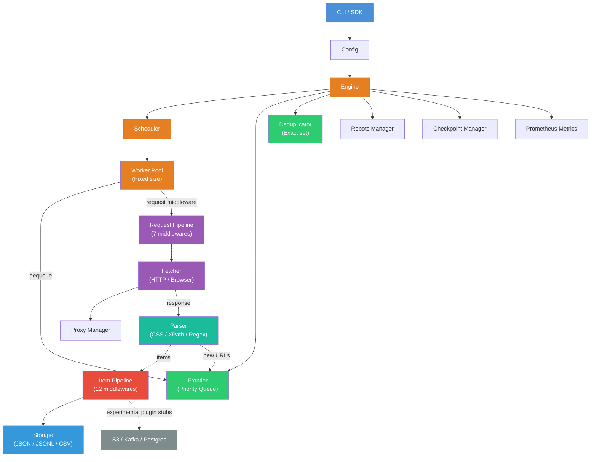

<div align="center">

# ScrapeGoat

### The high-performance web scraping framework written in Go.

**Scrapy's architecture + Go's concurrency + MCP integration + LLM extraction. One binary, no required services.**

[](https://goreportcard.com/report/github.com/IshaanNene/ScrapeGoat)
[](https://opensource.org/licenses/Apache-2.0)
[](https://pkg.go.dev/github.com/IshaanNene/ScrapeGoat)
[](docs/mcp.md)

</div>

---

## Why ScrapeGoat in 2025?

| Tool | Weakness | ScrapeGoat's Advantage |
|------|----------|----------------------|
| **Scrapy** | Python, slower concurrency, no MCP | Go goroutines, single-binary deploy, native MCP server |
| **Playwright** | Heavy browser automation, no extraction | Lightweight HTTP + LLM-powered structured extraction |
| **Apify** | SaaS lock-in, paid tiers | Self-hosted, open-source, REST API included |
| **Colly** | Limited pipeline, no anti-bot | Full middleware pipeline + adaptive anti-bot engine |
| **FireCrawl** | SaaS only, API limits | Self-hosted, unlimited, same LLM extraction |

> **ScrapeGoat combines Scrapy's architecture with Go's concurrency, MCP tool integration, and LLM-powered extraction — all in a single binary.**

---

## Quick Start

```bash
# Install
go install github.com/IshaanNene/ScrapeGoat/cmd/scrapegoat@latest

# Auto-extract structured data from any URL (no code needed!)
scrapegoat extract https://books.toscrape.com

# Create a project
scrapegoat new project my_scraper
cd my_scraper

# Run your spider
go run ./spiders/
```

## One-Liner Auto-Extract

```bash
$ scrapegoat extract https://books.toscrape.com

{
  "url": "https://books.toscrape.com",
  "title": "All products | Books to Scrape",
  "type": "product",
  "data": [
    {"_type": "product", "name": "A Light in the Attic", "price": "£51.77", "rating": 3},
    {"_type": "product", "name": "Tipping the Velvet", "price": "£53.74", "rating": 1}
  ]
}
```

---

## Architecture


```mermaid
graph TD
    CLI["CLI / SDK"] --> CFG["Config"]
    CFG --> ENG["Engine"]
    ENG --> SCH["Scheduler"]
    ENG --> FRT["Frontier<br>(Priority Queue)"]
    ENG --> DDP["Deduplicator<br>(Exact set)"]
    ENG --> RBT["Robots Manager"]
    ENG --> CHK["Checkpoint Manager"]
    ENG --> MET["Prometheus Metrics"]
    SCH --> WRK["Worker Pool<br>(Fixed size)"]
    WRK -->|"dequeue"| FRT
    WRK -->|"request middleware"| MID["Request Pipeline<br>(7 middlewares)"]
    MID --> FET["Fetcher<br>(HTTP / Browser)"]
    FET --> PXY["Proxy Manager"]
    FET -->|"response"| PAR["Parser<br>(CSS / XPath / Regex)"]
    PAR -->|"items"| PIP["Item Pipeline<br>(12 middlewares)"]
    PAR -->|"new URLs"| FRT
    PIP --> STR["Storage<br>(JSON / JSONL / CSV)"]
    PIP -. "experimental plugin stubs" .-> PLG["S3 / Kafka / Postgres"]

    style CLI fill:#4A90D9,color:#fff
    style ENG fill:#E67E22,color:#fff
    style SCH fill:#E67E22,color:#fff
    style WRK fill:#E67E22,color:#fff
    style FRT fill:#2ECC71,color:#fff
    style DDP fill:#2ECC71,color:#fff
    style MID fill:#9B59B6,color:#fff
    style FET fill:#9B59B6,color:#fff
    style PAR fill:#1ABC9C,color:#fff
    style PIP fill:#E74C3C,color:#fff
    style STR fill:#3498DB,color:#fff
    style PLG fill:#7F8C8D,color:#fff
```

---

## Spider Interface (Scrapy-Style)

```go
type ProductSpider struct{}

func (s *ProductSpider) Name() string { return "products" }

func (s *ProductSpider) StartURLs() []string {
    return []string{"https://books.toscrape.com"}
}

func (s *ProductSpider) Parse(resp *scrapegoat.Response) (*scrapegoat.SpiderResult, error) {
    result := &scrapegoat.SpiderResult{}
    resp.Doc.Find(".product_pod").Each(func(i int, s *goquery.Selection) {
        item := scrapegoat.NewItem(resp.URL)
        item.Set("title", s.Find("h3 a").AttrOr("title", ""))
        item.Set("price", s.Find(".price_color").Text())
        result.Items = append(result.Items, item)
    })
    return result, nil
}

func main() {
    scrapegoat.RunSpider(&ProductSpider{},
        scrapegoat.WithConcurrency(10),
        scrapegoat.WithMaxDepth(3),
        scrapegoat.WithOutput("json", "./output"),
    )
}
```

---

## Features

| Category | Features |
|----------|----------|
| **Core Engine** | Priority queue frontier, per-domain throttling, fixed-size worker pool, exact-set dedup |
| **MCP Server** | JSON-RPC 2.0, stdio + HTTP/SSE transports, 8 tools for Claude/Cursor/Cline |
| **LLM Extraction** | OpenAI, Anthropic, Ollama backends; schema-based extraction; SQLite caching |
| **API Server** | REST + WebSocket, job management, real-time streaming, API key auth, CORS |
| **Anti-Bot** | Pattern-based block detection (Cloudflare, DataDome, PerimeterX, Akamai), adaptive strategy escalation, human behaviour simulation, 5 stealth browser profiles |
| **Parsing** | CSS selectors, XPath, Regex, JSON-LD, OpenGraph, structured data, auto-extraction |
| **Transforms** | Schema validation (7 types), 6 composable transforms, drop/annotate/log failure modes |
| **Change Detection** | SQLite-persisted monitoring, hash/selector diffing, webhook notifications |
| **SDKs** | Python (sync + async, httpx + pydantic) and TypeScript (native fetch, zero deps) |
| **Crawl Graph** | SQLite-backed URL graph, DOT/Mermaid/JSON/CSV export, replay strategies |
| **Plugin SDK** | init() registration, BasePlugin embeddable, filter/transform middleware helpers |
| **Middleware** | 7 request middlewares + 12 item pipeline middlewares, fully extensible |
| **Storage** | JSON, JSONL, CSV file storage; experimental S3/Kafka/PostgreSQL plugin stubs |
| **Distributed** | Master/worker HTTP coordination; Redis-backed task queue with at-least-once delivery and abandoned-task recovery, or in-memory for single-process |
| **Browser** | Headless Chromium via go-rod, JS rendering, form filling, infinite scroll |
| **Observability** | Prometheus metrics endpoint, web dashboard, real-time stats |
| **DevEx** | CLI scaffolding, REPL, YAML config, checkpoint pause/resume (`--resume`), `robots.txt` compliance |

> Subsystems that are implemented and tested but **not yet wired into the crawl path** — the autoscaled
> pool, Bloom filter dedup, and in-process tracing — are tracked in [ROADMAP.md](ROADMAP.md) rather than
> listed above. If it is in the table, it runs.

---

## Security posture

A crawler is a program that fetches URLs someone else chose. When it also exposes an
MCP server, those URLs come from a model whose output was shaped by the last page it
read — which is a prompt-injection channel aimed straight at your network.

ScrapeGoat treats that as the threat model rather than an edge case:

- **Outbound requests are guarded.** Scheme allowlist, plus post-DNS blocking of
  loopback, RFC1918, link-local (including the cloud metadata endpoint at
  `169.254.169.254`), CGNAT, and their IPv4-mapped and NAT64-embedded equivalents.
- **DNS rebinding does not work.** The guard resolves once and dials the address it
  validated, rather than handing the hostname back to the resolver.
- **Every redirect hop is re-checked.** A `302` to the metadata endpoint is blocked
  at hop three the same as at hop one.
- **The API server fails closed.** No API key, no start — unless you pass
  `--insecure-no-auth`. CORS is deny-by-default and WebSocket upgrades check
  `Origin`.
- **Responses are capped after decompression**, with a compression-ratio limit, so a
  gzip bomb cannot exhaust memory.

Opt out for internal crawling with `safety.allow_private_addresses`. The full trust
boundary, including what is *not* covered — proxied requests and the headless
browser — is in [SECURITY.md](SECURITY.md).

---

## CLI Commands

```bash
scrapegoat crawl <url>           # Crawl with link following
scrapegoat extract <url>         # Auto-extract structured data
scrapegoat search <url>          # Full-text search indexing
scrapegoat serve                 # Start REST/WebSocket API server
scrapegoat mcp                   # Start MCP server (stdio or HTTP)
scrapegoat graph                 # Export crawl graph (json/dot/mermaid/csv)
scrapegoat replay                # Generate re-crawl URL list from graph
scrapegoat watch <urls...>       # Monitor URLs for content changes
scrapegoat diff <url>            # Show change history for a URL
scrapegoat new spider <name>     # Scaffold a spider
scrapegoat new project <name>    # Scaffold entire project
scrapegoat master                # Start distributed coordinator
scrapegoat worker                # Start distributed worker
scrapegoat scale <n>             # Scale workers
scrapegoat dashboard             # Launch web dashboard
scrapegoat benchmark <url>       # Performance benchmarks
scrapegoat config                # Show configuration
scrapegoat version               # Print version
```

---

## Plugin Ecosystem

```go
// Register built-in plugins
registry := plugin.NewRegistry(logger)
builtin.RegisterBuiltinPlugins(registry, logger)

// Experimental built-in plugin stubs:
// • scrapegoat-s3        — writes S3-shaped batches to a local fallback
// • scrapegoat-kafka     — logs publish operations for future Kafka integration
// • scrapegoat-postgres  — buffers/logs inserts for future PostgreSQL integration

// Custom plugin
type MyPlugin struct{}
func (p *MyPlugin) Name() string            { return "my-plugin" }
func (p *MyPlugin) Type() plugin.PluginType { return plugin.PluginTypeStorage }
func (p *MyPlugin) Store(items []*types.Item) error { /* ... */ }
```

---

## Distributed Crawling

```bash
# Terminal 1: Start master
scrapegoat master --addr :8081

# Terminal 2-4: Start workers
scrapegoat worker --master http://localhost:8081 --capacity 10

# Submit crawl task
curl -X POST http://localhost:8081/api/submit \
  -d '{"type":"crawl","urls":["https://example.com"]}'
```

---

## Configuration

```yaml
engine:
  concurrency: 10
  max_depth: 5
  politeness_delay: 1s
  respect_robots_txt: true

browser:
  render: false
  browser_type: chromium
  headless: true

middleware:
  request:
    - name: header_rotation
    - name: request_fingerprint
    - name: captcha_detection
    - name: cloudflare_detection

storage:
  type: json
  output_path: ./output

distributed:
  enabled: false
  master_addr: ":8081"
  # Redis fields are placeholders until the real Redis queue backend lands.
  redis_addr: "localhost:6379"
```

---

## Docker

```bash
docker-compose up -d
scrapegoat crawl https://example.com
```

---

## Project Structure

```
ScrapeGoat/
├── cmd/scrapegoat/          # CLI entry point (20 commands)
├── pkg/scrapegoat/          # Public SDK (Spider + Crawler APIs)
├── internal/
│   ├── engine/              # Core: scheduler, frontier, dedup, bloom, autoscale, checkpoint, robots
│   ├── mcp/                 # MCP server (JSON-RPC 2.0, stdio+HTTP transport, 8 tools)
│   ├── llmextract/          # LLM extraction engine (OpenAI, Anthropic, Ollama + SQLite cache)
│   ├── apiserver/           # REST + WebSocket API server with job management
│   ├── antibot/             # Adaptive anti-bot engine, stealth profiles, human simulation
│   ├── crawlgraph/          # Crawl graph with SQLite, export (DOT/Mermaid/JSON/CSV), replay
│   ├── changedetect/        # Content change monitoring with notifications
│   ├── transforms/          # Schema validation + composable data transforms
│   ├── middleware/           # Request middleware pipeline (7 built-in)
│   ├── fetcher/             # HTTP/browser fetcher, proxy, stealth, CAPTCHA, session pool
│   ├── parser/              # CSS, XPath, regex, structured data, auto-extractor
│   ├── pipeline/            # Item processing pipeline (12 middlewares)
│   ├── storage/             # JSON, JSONL, CSV storage
│   ├── plugin/              # Plugin registry + SDK + experimental storage stubs
│   ├── distributed/         # Master/worker, in-memory task queue
│   ├── observability/       # Prometheus metrics, in-process tracing primitives
│   ├── dashboard/           # Web dashboard
│   ├── automation/          # Browser automation (go-rod)
│   ├── benchmark/           # Performance comparison tool
│   ├── seo/                 # SEO audit, sitemap crawler
│   ├── repl/                # Interactive REPL
│   └── config/              # Configuration management + validation
├── sdks/
│   ├── python/              # Python SDK (httpx + pydantic, sync + async)
│   └── typescript/          # TypeScript SDK (native fetch, zero deps)
├── examples/                # 9 example spiders
├── docs/                    # Architecture, API spec (OpenAPI), MCP setup, quickstart
├── configs/                 # Default YAML configs
└── .github/workflows/       # CI: tests, benchmarks, Python SDK
```

---

## Testing

```bash
make test           # Unit tests
make test-race      # Race condition detection
make bench          # Benchmarks
make lint           # Linting
make build          # Build binary
```

### Fuzzing

Everything ScrapeGoat parses comes from a site it does not control, so the parsers
are fuzz-tested and CI runs each target for 60 seconds on every push. Targets cover
HTML parsing, CSS selectors, regex patterns, URL canonicalisation, `robots.txt`
parsing and pattern matching, the decompression path, `Retry-After`, the MCP
JSON-RPC decoder, and the SSRF guard.

```bash
go test -run=XXX -fuzz=FuzzCompositeParse -fuzztime=60s ./internal/parser
```

---

## Documentation

- **[Quick Start](docs/quickstart.md)** — Get running in 3 minutes
- **[Architecture](docs/architecture.md)** — How the components fit together
- **[Security](SECURITY.md)** — Trust boundary, the SSRF guard, and known limitations
- **[Roadmap](ROADMAP.md)** — What is designed but not yet wired in
- **[Changelog](CHANGELOG.md)** — Release history
- **[API Reference](docs/api.yaml)** — OpenAPI 3.1 specification
- **[MCP Integration](docs/mcp.md)** — Claude Desktop / Cursor / Cline setup
- **[Middleware](docs/middleware.md)** — Request and item middleware system
- **[Distributed](docs/distributed.md)** — Master/worker setup
- **[Python SDK](sdks/python/README.md)** — Python client (sync + async)
- **[TypeScript SDK](sdks/typescript/README.md)** — TypeScript/JavaScript client
- **[Examples](docs/examples.md)** — All example spiders

---

## Contributing

See [CONTRIBUTING.md](CONTRIBUTING.md) for guidelines.

## License

Apache License 2.0 — see [LICENSE](LICENSE) for details.

---

<div align="center">

**Built in Go**

[Star on GitHub](https://github.com/IshaanNene/ScrapeGoat) · [Docs](docs/) · [Issues](https://github.com/IshaanNene/ScrapeGoat/issues)

</div>
