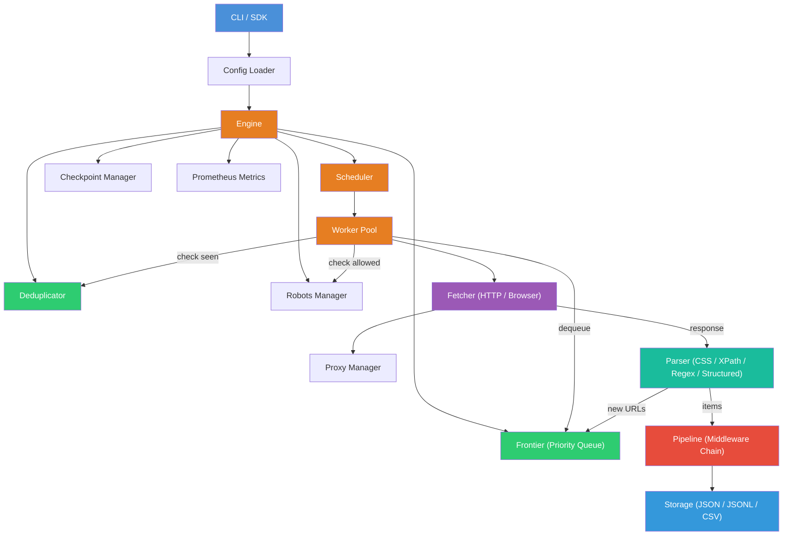
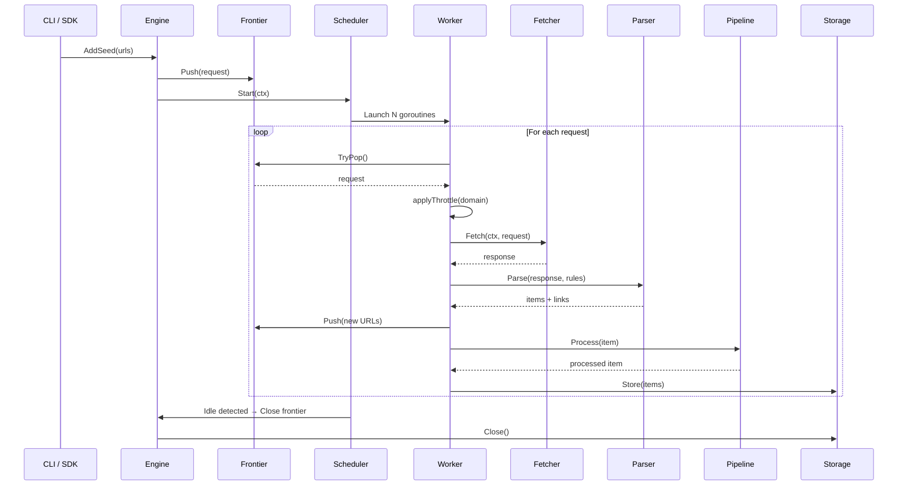

# ScrapeGoat Architecture

This document describes the internal architecture of ScrapeGoat — how the components fit together, how data flows through the system, and the design decisions behind each layer.

---

## High-Level Architecture



---

## Component Breakdown

### Engine (`internal/engine/`)

The **Engine** is the central orchestrator. It owns all subsystems and coordinates the crawl lifecycle.

| Responsibility | Implementation |
|---|---|
| Lifecycle management (start/stop/pause/resume) | State machine with `StateIdle → StateRunning → StateStopping → StateStopped` |
| Component wiring | Accepts pluggable `Fetcher`, `Parser`, `Pipeline`, `Storage` via interfaces |
| Seed URL injection | `AddSeed()` validates, deduplicates, and enqueues URLs |
| Stats tracking | Thread-safe `atomic.Int64` counters for requests, responses, bytes, items |
| Graceful shutdown | SIGINT/SIGTERM handler preserves state via checkpoint |

### Scheduler (`internal/engine/scheduler.go`)

The **Scheduler** runs a pool of N worker goroutines (configurable via `concurrency`).

Each worker:
1. Dequeues from the **Frontier** (non-blocking `TryPop` with polling)
2. Applies **per-domain throttling** (configurable `politeness_delay`)
3. Delegates to the **Fetcher**
4. Passes responses through registered **callbacks** and/or the **Parser**
5. Enqueues discovered URLs back into the Frontier
6. Sends extracted items to the **Pipeline**

An **idle monitor** goroutine detects when all workers are idle and the frontier is empty for 3 consecutive checks (~600ms), then signals crawl completion.

### Frontier (`internal/engine/frontier.go`)

Thread-safe **priority queue** backed by `container/heap` (min-heap). Lower priority value = higher priority.

- `Push(req)` — enqueue with priority
- `TryPop()` — non-blocking dequeue
- `Pop(ctx)` — blocking dequeue with context cancellation
- `Snapshot()` — non-destructive copy for checkpointing
- `Drain()` / `RestoreAll()` — for checkpoint save/restore

### Deduplicator (`internal/engine/dedup.go`)

Prevents re-crawling the same URL. Uses **URL canonicalization**:
- Lowercases scheme + host
- Removes fragments
- Sorts query parameters
- Strips default ports (80/443)
- Removes trailing slashes

Stores SHA-256 hashes (128-bit truncated) in a `map[string]struct{}` with `sync.RWMutex`.

### Fetcher (`internal/fetcher/`)

**Interface-based** design: any type implementing `Fetch(ctx, *Request) (*Response, error)` can be plugged in.

Built-in implementations:
- **HTTPFetcher** — `net/http` with connection pooling, cookie jar, brotli/gzip/deflate decompression, configurable TLS
- **BrowserFetcher** — headless browser via Chromedp (for JS-rendered pages)

Key features:
- **User-Agent rotation** — round-robin through configured agents
- **Retry-After support** — respects HTTP 429 headers
- **Retryable error detection** — timeouts, connection resets, 5xx errors
- **Proxy integration** — delegates to `ProxyManager`

### Proxy Manager (`internal/fetcher/proxy.go`)

Manages a pool of proxy servers with:
- **Round-robin** or **random** rotation strategies
- **Health checking** — pings each proxy periodically
- **Dynamic addition** — `AddProxy()` at runtime
- **Failure tracking** — unhealthy proxies are skipped until recovered

### Parser (`internal/parser/`)

**Interface-based**: all parsers implement `Parse(resp, rules) → (items, links, error)`.

Built-in parsers:
- **CSS** — goquery selectors
- **XPath** — htmlquery-based
- **Regex** — named capture groups
- **Structured Data** — JSON-LD, OpenGraph, Twitter Cards, meta tags
- **DOM Traversal** — table extraction, list extraction
- **Auto Selector** — heuristic CSS selector generation
- **Composite** — chains all parsers together

### Pipeline (`internal/pipeline/`)

Middleware chain pattern. Each middleware implements:
```go
type Middleware interface {
    Name() string
    Process(item *Item) (*Item, error)  // return nil to drop
}
```

Built-in middleware:
| Middleware | Purpose |
|---|---|
| `TrimMiddleware` | Strip whitespace from string fields |
| `HTMLSanitizeMiddleware` | Remove HTML tags, decode entities |
| `PIIRedactMiddleware` | Redact emails, SSNs, phone numbers |
| `DateNormalizeMiddleware` | Parse various date formats → ISO 8601 |
| `CurrencyNormalizeMiddleware` | Strip currency symbols, normalize decimals |
| `TypeCoercionMiddleware` | String → int/float/bool conversion |
| `DedupMiddleware` | Drop items with duplicate keys |
| `RequiredFieldsMiddleware` | Drop items missing required fields |
| `FieldFilterMiddleware` | Keep only specified fields |
| `FieldRenameMiddleware` | Rename fields |
| `DefaultValueMiddleware` | Set defaults for missing fields |
| `WordCountMiddleware` | Add word counts for text fields |

### Storage (`internal/storage/`)

**Interface-based**: `Store(items) error` + `Close() error`.

Implementations:
- **JSON** — pretty-printed array
- **JSONL** — newline-delimited, streaming
- **CSV** — auto-detected headers from first batch

### Checkpoint (`internal/engine/checkpoint.go`)

Enables **pause/resume** crawls:
- Serializes frontier queue, dedup hashes, and stats to JSON
- **Atomic writes** (write to temp file, then rename)
- Automatic periodic checkpointing (configurable interval)
- Restored on engine start if checkpoint file exists

---

## Data Flow



---

## Infrastructure

### Docker Compose Services

| Service | Purpose |
|---|---|
| **Redis** | Future distributed queue, caching layer, pub/sub for worker coordination |
| **Postgres** | Structured storage for crawl results, job metadata, URL history |

> These services are optional — ScrapeGoat works standalone with file-based storage. Docker Compose is provided for users who want persistent, queryable storage.

---

## Design Decisions

### Why Interfaces Everywhere?

Every major component (Fetcher, Parser, Pipeline, Storage) is behind a Go interface. This enables:
- **Testing** — mock any layer independently
- **Extensibility** — users can implement custom fetchers, parsers, storage backends
- **Composition** — the engine doesn't know or care about implementation details

### Why Per-Domain Throttling?

Global rate limiting is insufficient — a polite crawler must respect each domain's capacity independently. The scheduler maintains a `map[string]*domainThrottle` with per-domain `sync.Mutex` to enforce configurable delays.

### Why Priority Queue Frontier?

Not all URLs are equally important. Retried requests get `PriorityLow`, while seed URLs get higher priority. The min-heap ensures critical pages are crawled first.

### Why Checkpoint Persistence?

Large crawls may take hours. Checkpointing enables:
- Resume after crashes
- Graceful shutdown on SIGINT/SIGTERM
- Pause/resume via SDK API
